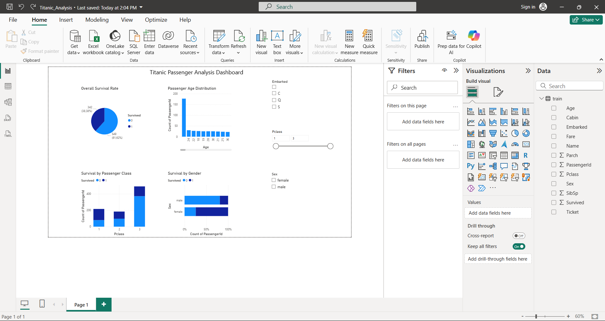

# Power BI Dashboards

This repository contains my Power BI projects as I develop my skills in data visualization and business intelligence.

## Project 1: Titanic Passenger Analysis

**Dashboard Preview:**

**Project Overview:**
An interactive Business Intelligence dashboard analyzing passenger demographics and survival rates on the Titanic. This demonstrates my ability to quickly learn and apply Power BI for data storytelling.

**Key Features:**
- Survival rate analysis by passenger class, gender, and age
- Interactive filters for dynamic data exploration  
- Multiple visualization types (pie charts, bar charts, histograms)
- Professional layout and data presentation

**Skills Demonstrated:**
- Data Import & Transformation
- Power BI Visualization Development
- Interactive Slicers & Filters
- Business Intelligence Dashboard Design
- Data Storytelling

**Files:**
- `Titanic_Analysis.pbix` - Power BI source file
- `dashboard_preview.png` - Dashboard screenshot
